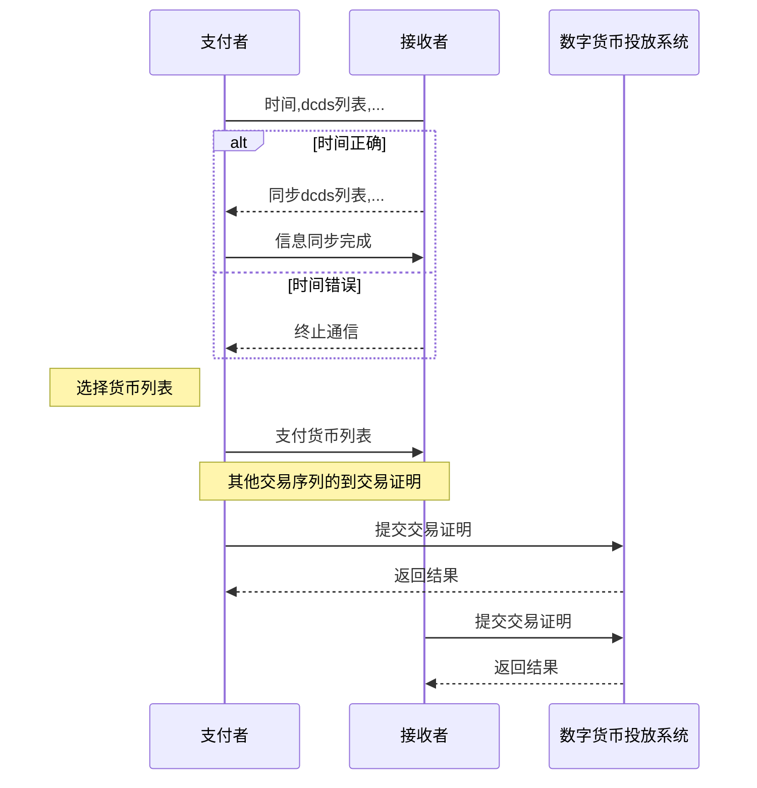

# RFC0006 简单双方交易框架

## 设计原理

简单双方交易框架是DCEP中规定双方交易流程的抽象框架，本部分概要描述了交易流程中双方进行沟通的信息。

## 具体设计

简单双方交易框架的设计包含三部分：同步系统信息，传输交易细节，提交交易见证

#### 交易流程



### 数字货币交易结构

```json
{
    "amount": 10, // 目标的交易金额
    "target": "", // 目标钱包标识
    "currencys": [
        "",
        "",
        ""
    ] 
}
```

## 需增加部分

- 