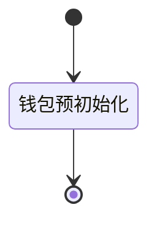

# RFC0008 钱包服务框架

## 设计原理

## 数据库设计

钱包底层采用SQLite3作为存储引擎。具体的数据表如下：

### 货币表（currency）

| Field               | Type         | Comment                             |
| ------------------- | ------------ | ----------------------------------- |
| id                  | varchar(255) | `QuotaControlField` 's key.         |
| quota_control_field | text         | `QuotaControlField`                 |
| explain_info        | jsonb        | Explain info of `QuotaControlField` |
| state               | varchar(255) | State of DCDS.                      |
| owner               | varchar(255) | Owner of QCF.                       |
| create_time         | timestamp    | Create time.                        |
| update_time         | timestamp    | Update time.                        |

### 交易列表（transactions）

| Field       | Type         | Comment              |
| ----------- | ------------ | -------------------- |
| id          | varchar(255) | `Transcation` 's id. |
| owner       | varchar(255) | Next owner of QCF.   |
| create_time | timestamp    | Create time.         |

### 对手方列表（payers）

| Field       | Type         | Comment                 |
| ----------- | ------------ | ----------------------- |
| id          | varchar(255) | `Payer` 's key.         |
| cert        | varchar(255) | Certificates for payer. |
| create_time | timestamp    | Create time.            |

## 钱包状态管理

### 钱包状态

钱包状态中定义了钱包状态的变换关系。



#### 可用API

> 此处定义了每个状态下允许调用的API。

##### PreInit

- 读取钱包信息

### 交易状态

定义了交易状态的变换关系。


#### 可用API

> 此处定义了每个状态下允许调用的API。

##### PreInit

- 读取钱包信息


## API设计

钱包底层采用SQLite作为存储引擎。具体的数据表

### 钱包配置

#### 钱包信息


##### 输入参数

```json
{"jsonrpc": "2.0", "method": "wallet.info", "params": null, "id": 1}
```

##### 输出参数

```json
{
    "jsonrpc": "2.0",
    "result": {
    	"status": "", // uninital, unregistered, normal
        "cert": "",   // 证书
        "id": "", // SHA3/SM4(cert)
        "account": {},
        "level": 1,
        "dcds": [
            {
            	"id": "", // SHA3/SM4(cert)
                "tx_url": "",
                "cert": "",
                "meta": {
                    "code": "",
                    "name": ""
                }
            }
        ]
    },
    "id": 1
}
```

#### 钱包注册

##### 输入参数

```json
{"jsonrpc": "2.0", "method": "wallet.registe", "params": "0x00", "id": 1}
```

##### 输出参数

```json
{"jsonrpc": "2.0", "result": null,"id": 1}
```

#### 修改账户信息

##### 输入参数

```json
{"jsonrpc": "2.0", "method": "wallet.account", "params": {}, "id": 1}
```

##### 输出参数

```json
{"jsonrpc": "2.0", "result": null,"id": 1}
```

#### 修改DCDS信息

##### 输入参数

```json
{"jsonrpc": "2.0", "method": "wallet.dcds.append", "params": {}, "id": 1}
{"jsonrpc": "2.0", "method": "wallet.dcds.remove", "params": "0x000", "id": 1}
```

##### 输出参数

```json
{"jsonrpc": "2.0", "result": null,"id": 1}
```


### 货币管理

#### 充值

##### 输入参数

```json
{"jsonrpc": "2.0", "method": "currency.deposit", "params": {"currencys":["0x000","0x000"],"value":1000}, "id": 1}
```

##### 输出参数

```json
{"jsonrpc": "2.0", "result": null,"id": 1}
```

#### 提现（待确定）

##### 输入参数

```json
{"jsonrpc": "2.0", "method": "currency.widthdraw", "params": 1000, "id": 1}
```

##### 输出参数

```json
{"jsonrpc": "2.0", "result": "0x00","id": 1}
```


#### 货币概览

##### 输入参数

```json
{"jsonrpc": "2.0", "method": "currency.statistics", "params": null, "id": 1}
```

##### 输出参数

```json
{
    "jsonrpc": "2.0", 
    "result": {
        "summary": {
            "total": 1000,
            "lock": 1000,
            "unlock": 1000
        },
        statistics: [
            {
                "value": 10000,
                "number": 100,
            }
        ]
    },
    "id": 1
}
```

#### 货币详情列表

##### 输入参数

```json
{"jsonrpc": "2.0", "method": "currency.list.detail", "params": {"page": 0, "size": 10, "order": "recv_time"}, "id": 1}
```

##### 输出参数

```json
{
    "jsonrpc": "2.0", 
    "result": [
        {
            "value": 1000,
            "id": "0x0000",
            "dcds": {},
            "locked": false,
            "owner": "",
            "issue_time": 123213123,
            "recv_time": 12312312,
        }
    ],
    "id": 1
}
```


#### 根据额度控制位id查询货币详情

##### 输入参数

```json
{"jsonrpc": "2.0", "method": "currency.ids.detail", "params": ["0x00"], "id": 1}
```

##### 输出参数

```json
{
    "jsonrpc": "2.0", 
    "result": [
        {
            "value": 1000,
            "id": "0x0000",
            "dcds": "",
            "locked": false,
            "owner": ""
        }
    ],
    "id": 1
}
```

### 交易管理

- 交易历史


- 交易确认

### 交易流程

交易流程

1. 交换背景信息

   ```json
   {
       "timestamp": 0, // 交易时间戳
       "dcds": [
           {
               "url": "http://.....",
               "cert": "0x00000",
               "meta": {
                   "code": "TOB",
                   "name": "测试银行"
               }
           }
       ],
       "exchanger": [
           {
               "cert": "0x00", // 交易方证书
               "output": 250, // 付款金额
               "input": 200, // 收款金额
               "addition": {}
           }
       ]
   }
   ```
   
2. 交换交易方案

   ```json
   [
   	{
   		"amount": 10000, 
           "number": 1,
           "from": 0,
           "to": 1
   	}
   ]
   ```

3. 确认交易签名

   ```json
   [
       "0x00",
       "0x00",
       "0x00"
   ]
   ```

   

交易状态机：

- Start -[RecvContext]-> Prepared
- 

### 货币兑换

- 兑换


## 需增加部分

- 